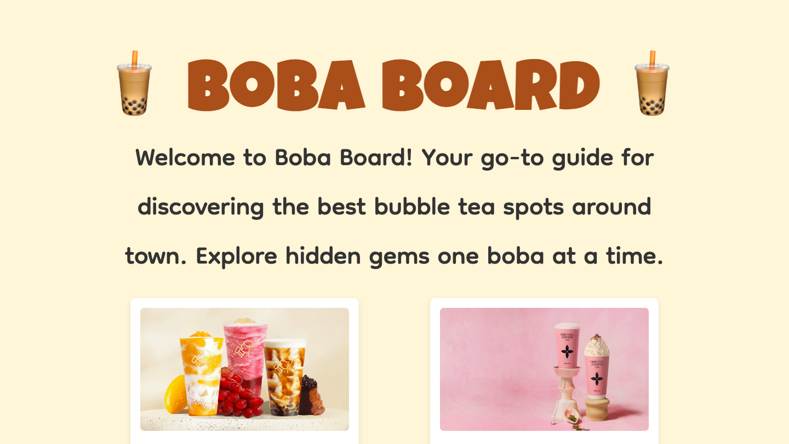
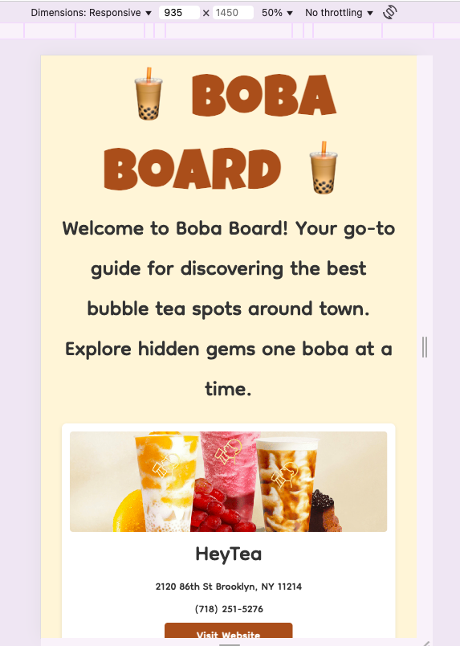
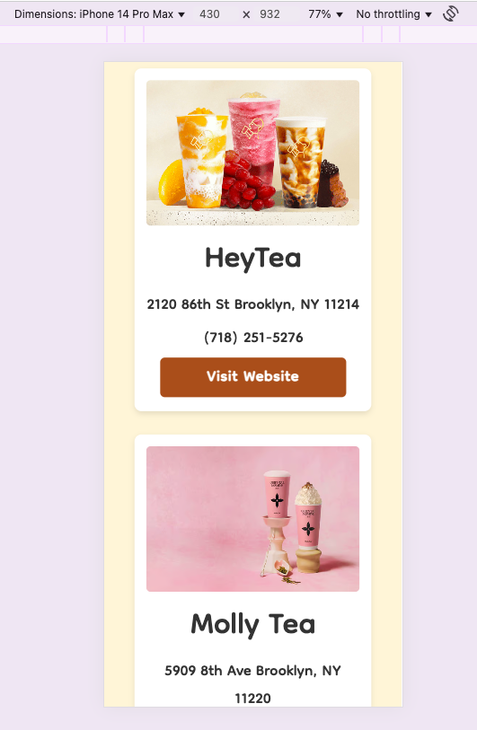

# Web Development Project 1 - *Boba Board*

Submitted by: **Kelly Chan**

This web app: **Boba Board is a page filled with bubble tea shops in my community, Brooklyn, designed to highlight hidden gems and community favorites. Each card offers store details, images, and a link to their website for further exploration.**

Time spent: **3** hours spent in total

## Required Features

The following **required** functionality is completed:

- [X] **The app has a cohesive, unique theme for events or resources relevant to a specific community**
  - [X] Header/title describing the theme is displayed
- [X] **At least 10 unique events or resources are displayed in a responsive card format**
  - [X] There are at least 10 cards displayed 
  - [X] The cards should be displayed in an organized format (ex. a grid, or in one line)
  - [X] Each card should include some information about the event or resource

The following **optional** features are implemented:

- [X] Buttons or links to a related resources are on each card component
  - [X] All cards have buttons or links in addition to text
- [X] The site is responsive for both desktop and mobile formats
  - [X] Web app is shown in a mobile format

The following **additional** features are implemented:

* [X] Custom fonts and colors for playful and inviting visual style

## Video Walkthrough

Here's a walkthrough of implemented required features:

GIF created with Adobe Express

## Video Walkthrough
**Desktop View:**

**Tablet View:**

**Mobile View:**

## Notes

One of the trickier parts was getting the images to look clean and consistent. Since they all had different shapes and sizes, the cards looked kind of messy at first. I ended up using 'object-fit: cover' and setting a fixed height on the images so they would all line up nicely. That made everything feel a lot more balanced and helped the layout look more put together.

## License

    Copyright 2025 Kelly Chan

    Licensed under the Apache License, Version 2.0 (the "License");
    you may not use this file except in compliance with the License.
    You may obtain a copy of the License at

        http://www.apache.org/licenses/LICENSE-2.0

    Unless required by applicable law or agreed to in writing, software
    distributed under the License is distributed on an "AS IS" BASIS,
    WITHOUT WARRANTIES OR CONDITIONS OF ANY KIND, either express or implied.
    See the License for the specific language governing permissions and
    limitations under the License.